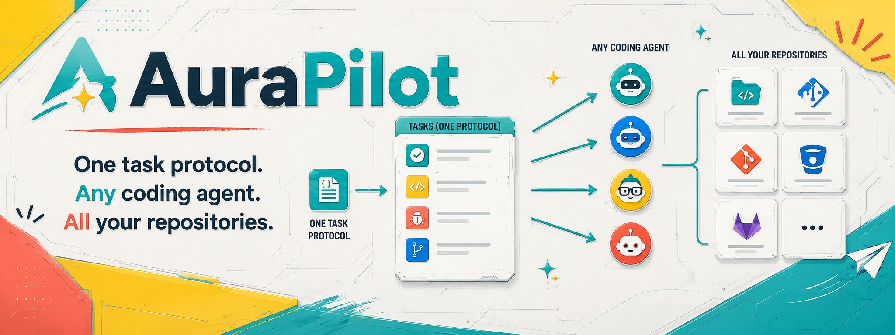

<p align="center">
  
</p>

<p align="center">
  <a href="https://github.com/gordonlu/AuraPilot/actions/workflows/ci.yml"></a>
  <a href="https://www.rust-lang.org/"></a>
  <a href="https://vuejs.org/"></a>
  <a href="https://vite.dev/"></a>
  <a href="https://www.typescriptlang.org/"></a>
  <a href="https://tauri.app/"></a>
  <a href="https://pinia.vuejs.org/"></a>
  <a href="https://vitest.dev/"></a>
  <a href="https://pnpm.io/"></a>
  <a href="LICENSE"></a>
  
</p>

<p align="center"><strong>One task protocol. Any coding agent. All your repositories.</strong></p>

AuraPilot is a local-first, cross-repository task control plane for AI coding agents.

## Quick start

```sh
cargo install --path crates/aurapilot-cli --locked
aurapilot init /path/to/repository
aurapilot add /path/to/repository
aurapilot task create /path/to/repository --title "My first task" --accept "Acceptance criterion"
aurapilot status
```

Continue with the [installation guide](docs/INSTALLATION.md) and the one-time [Agent Bootstrap guide](docs/BOOTSTRAP.md).

## Managed Codex CLI (Beta)

AuraPilot can start a shared Codex App Server and open a Codex CLI attached to a project Session with one command:

```sh
# Resume the project's most recently used Codex Session.
aurapilot codex open /path/to/repository

# Or select an AuraPilot Session binding UUID / Codex Thread ID explicitly.
aurapilot codex open /path/to/repository --session <session-id>

# Inspect the shared App Server without opening the CLI.
aurapilot codex status
```

When the project has no recorded Codex Session, `codex open` creates and records one before opening the terminal UI. AuraPilot desktop and this CLI reuse the same local App Server, so a Push to that Session can appear in the attached terminal instead of an unrelated window.

> **Beta:** managed startup currently supports Unix/Linux only and depends on Codex's evolving App Server and remote-resume interfaces. It may be unstable across Codex releases. Interactive approval requests are not yet handled by AuraPilot, so a task that needs approval can fail with an explicit error. Check the selected Session ID before Push and keep the copy-prompt fallback available.

## Background Agent runs (Beta)

The desktop Push flow can also execute a task in a background Agent Session. This is useful when no managed terminal is attached, but the work is not visible in the current CLI window and can conflict with edits in the same working tree.

> **Beta:** background execution may be unstable and generally consumes more tokens because its context is independent from your current foreground conversation. Review the selected Session, task activity log, Git diff, and verification evidence before accepting its result.

## Portable task packages

Use `.aura` packages to move task records that you do not want to send through Git. Import always starts with a version, integrity, schema, path-safety, and conflict preview; applying the import requires the SHA-256 printed by that preview. Existing task files are never overwritten.

```sh
# Export all tasks as an ordinary, unencrypted package.
aurapilot task export /path/to/source --output tasks.aura

# Optional encryption reads the password from a file, not a command-line argument.
aurapilot task export /path/to/source --output private.aura --password-file /path/to/password.txt

# Preview first, then repeat with the printed digest.
aurapilot task import /path/to/destination tasks.aura
aurapilot task import /path/to/destination tasks.aura --apply <preview-sha256>
```

Ordinary packages are compressed but **not encrypted**. Password-protected packages use authenticated encryption and require the same password file for preview and import. The desktop app exposes the same flow under **任务包**.

## Workspace

- `crates/aurapilot-core`: protocol models, validation, path safety, locking, task IDs, and file transactions.
- `crates/aurapilot-cli`: repository initialization, registration, status, task creation, portable task transfer, and managed Codex CLI entrypoint.
- `crates/aurapilot-codex`: shared Codex App Server transport used by the CLI and Tauri desktop shell.
- `src-tauri`: Tauri 2 desktop shell. Its development identifier is not part of the AuraPilot protocol.
- `web`: Vue 3 + Vite + TypeScript + Pinia frontend, tested with Vitest.
- `prototype`: preserved legacy HTML/CSS/JavaScript interaction prototype. It is reference-only; production frontend code lives in `web/src`.

## Development

Use pnpm exclusively for JavaScript dependencies. The committed `pnpm-lock.yaml` is authoritative.

```sh
pnpm install
pnpm test
pnpm build
cargo test -p aurapilot-core
```

The Bootstrap document is validated only in an isolated repository during Phase 5. It must not be executed against this repository during normal development.
